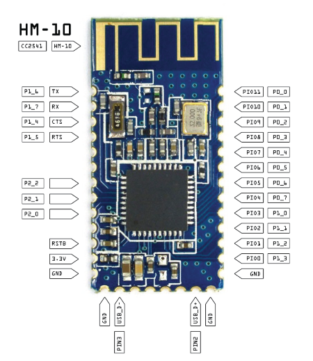
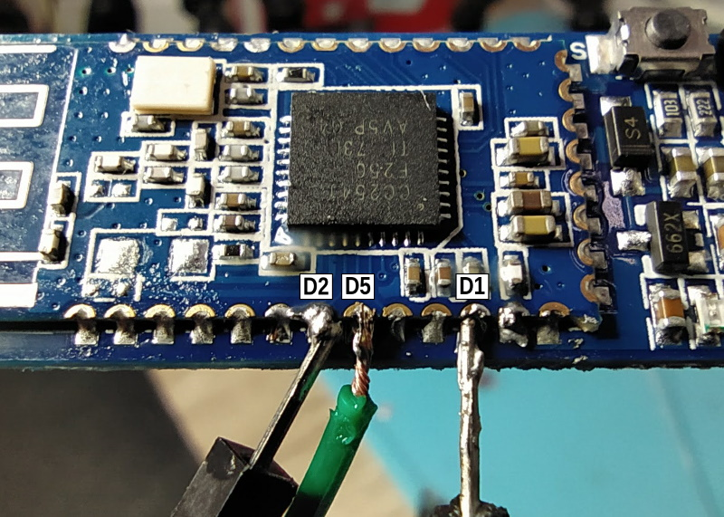
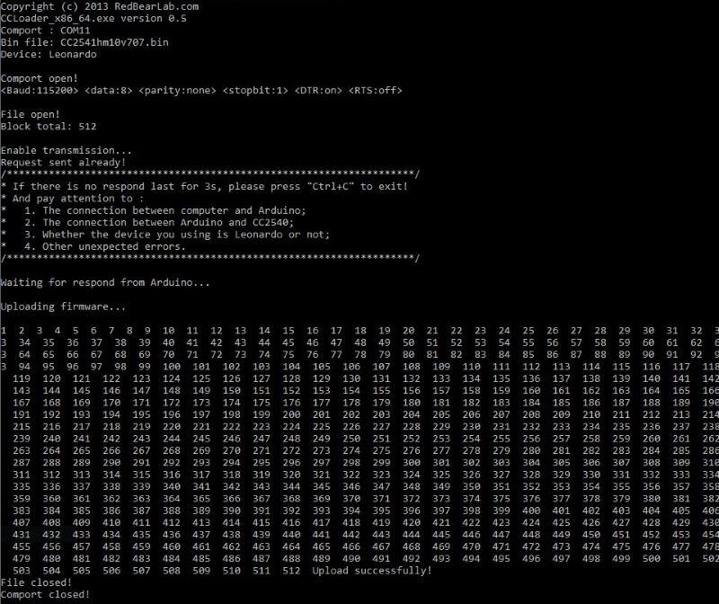

CCLoader
========

Burn CC25xx/HM10 firmware using a NodeMCU or Wemos D1 mini.

Flashing CC2530 or CC2531
==========================
Use the files provided in folder [`Bin`](/Bin). The Hex files are already converted and ready to flash with CCLoader 
More [Zigbee](https://www.zigbee2mqtt.io/information/alternative_flashing_methods.html) information.

Flashing HM10
==========================
1. Load the already compiled [CCLoader Arduino firmware](/Bin/CCLoader_Arduino.bin) to a NodeMCU/Wemos board.

  
2. Wire the pins:

| Pin Name | Pin# | NodeMCU/Wemos Pin | GPIO# |
| --- | --- | --- | --- |  
| P2_1 (DEBUG_DATA) | Pin #8 | D5 | GPIO14 |
| P2_2 (DEBUG_CLOCK) | Pin #7 | D2 | GPIO4 |
| RSTB (RESET_N)| Pin #11 | D1 | GPIO5 |
| 3.3V | Pin #12 | 3.3V | |  
| GND | Pin #13 | GND | |

3. Use CCLoader.exe to load the [CC2541hm10v707.bin](/Bin/CC2541hm10v707.bin) firmware via the NodeMCU to the HM-10 with command: 
   `CCLoader_x86_64.exe [Number of the COM port] CC2541hm10v707.bin 0`  

4. You should see a result similar to

### Troubleshooting
If you're not sure the flash succeeded connect to HM-10 module over serial and issue `AT+VERR` commands which should show `v707`.

If you cannot communicate with the HM-10 module even after a successful firmware flash change you serial terminal baudrate to 9600, then issue `AT+RENEW` command which should reset the module to firmware factory settings and the proper 115200 baudrate. 

[Help Video](https://www.youtube.com/watch?v=ez3491-v8Og&lc=z23dzv5wvxrkghouvacdp43beqjns0ivud2tbkcab1xw03c010c.1542030938199060)  

You can Up- and Downgrade to other firmwares using the [Manufacturer upgrade tool](http://www.jnhuamao.cn/download_rom_en.asp?id=).  

[More Information](https://forum.arduino.cc/index.php?topic=393655.0)   

